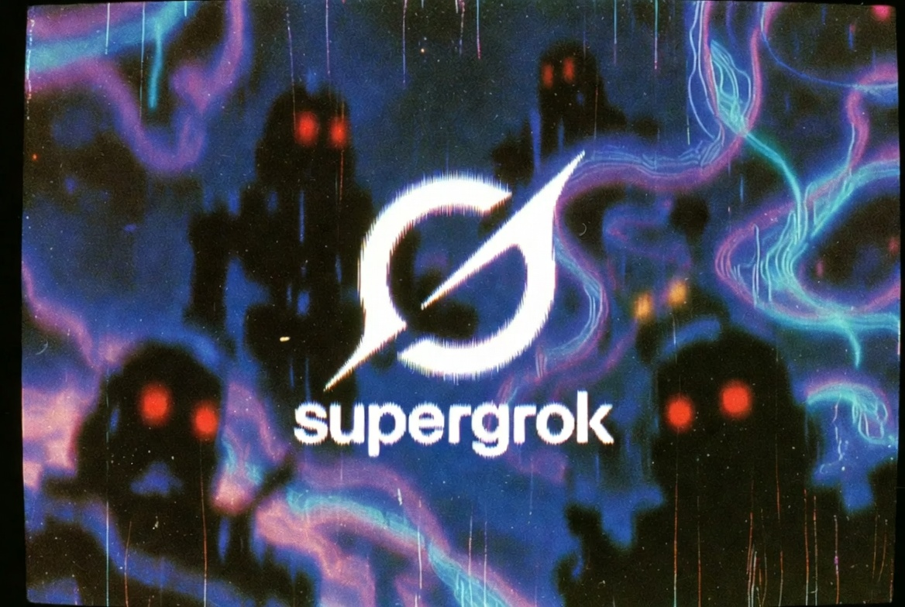

# SuperGrok Pro Chrome Extension

Built by [@dreamingtulpa](https://x.com/dreamingtulpa) for the [Pale Fire](https://distrokid.com/hyperfollow/dreamingtulpa/pale-fire) music video.

A Chrome extension to navigate, select, and batch download images and videos from your Grok (xAI) generation history.

## ⚠️ Disclaimer

**This project is unofficial and is NOT affiliated with, endorsed by, or connected to Grok or xAI.**

This extension relies entirely on the current structure of `grok.com`. When xAI updates their website (CSS classes, DOM structure, or API), this extension **will likely break**. I may or may not update it when that happens. Use at your own risk.

## Features

- **Keyboard Navigation:** Use `J` and `K` to scroll through your media feed.
- **Quick Selection:** Press `X` to select an item.
- **Paint Selection:** Hold `X` while navigating with `J` or `K` to rapidly select multiple items.
- **Batch Downloading:** Downloads selected media into ZIP files.
- **Memory Safety:** Automatically splits large downloads into batches to prevent browser crashes.

## Installation

1. Clone or download this repository.
2. Open Chrome and go to `chrome://extensions/`.
3. Enable **Developer mode** in the top right.
4. Click **Load unpacked** and select the folder containing these files.

## How to Use

1. Navigate to your Grok history (e.g., `https://grok.com/imagine/favorites`).
2. Use **J/K** to move up and down the list.
3. Press **X** to select the images/videos you want to save.
4. Click the **"Download ZIP"** button that appears in the floating toolbar.

### Settings

If your browser crashes while downloading many files, click the extension icon in your browser toolbar to reduce the **Batch Size** (default is 25).
